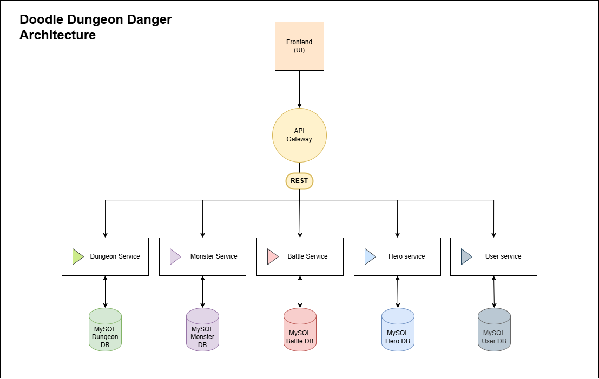
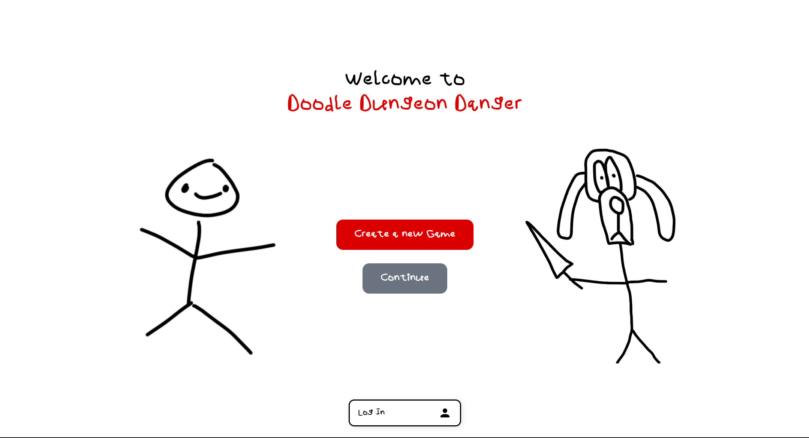
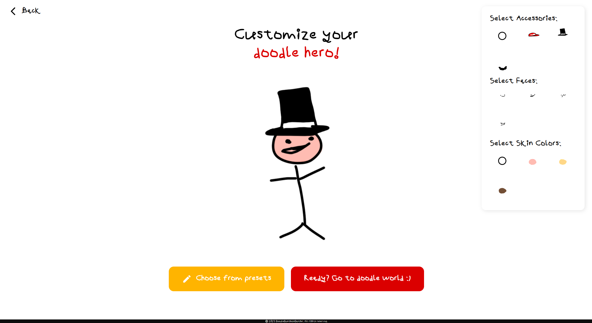
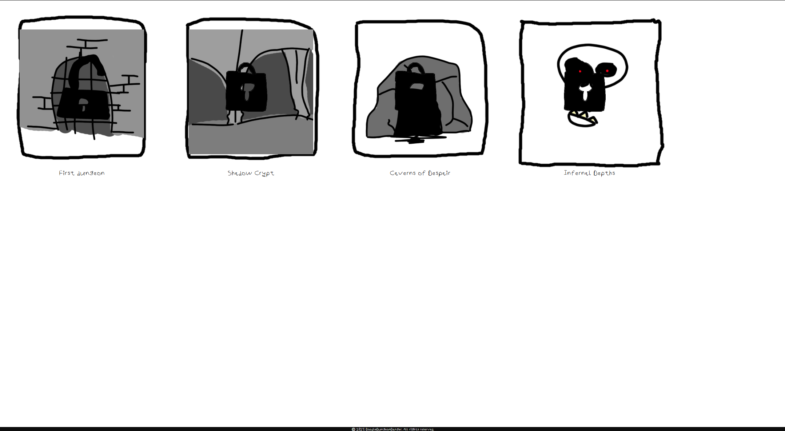
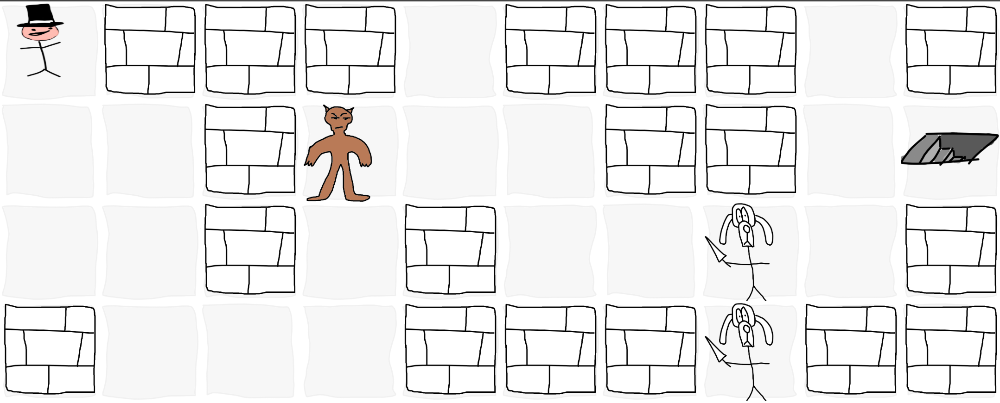
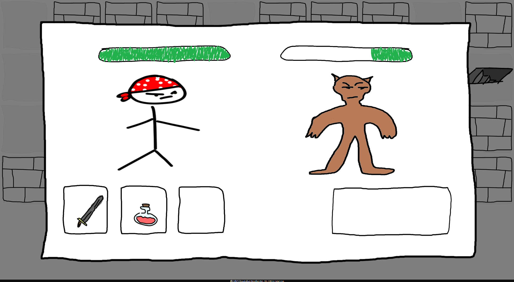

# DoodleDungeonDanger


## About the Project

**Version: 1.0.0**  

DoodleDungeonDanger is an adventure game where the player progresses by fighting monsters and completing dungeons one by one. The ultimate goal is to finish all dungeons by defeating all the monsters inside. Players can create an account or log in to save their progress and resume their game later.

---

## Table of Contents

- [About the Project](#about-the-project)
- [Architecture](#architecture)
  - [Technologies Used](#technologies-used)
  - [Backend Services](#backend-services)
- [Installation](#installation)
  - [Prerequisites](#prerequisites)
  - [Project Installation](#project-installation)
- [Usage](#usage)
- [Available Scripts](#available-scripts)
- [Database Configuration](#database-configuration)
- [Graphics](#graphics)
- [Authors](#authors)
- [License](#license)

---

## Architecture

DoodleDungeonDanger is built on a microservices architecture with a monorepo containing a frontend and a backend exclusively composed of services.


***Diagram : Doodle dungeon danger architecture***

### Technologies Used
- **Frontend**: React
- **Backend**: Node.js (Microservices architecture)
- **Database**: MySQL (one DB per service)
- **Messaging**: RabbitMQ
- **Containerization**: Docker

### Backend Services
1. **UserService**: Manages authentication and user accounts.
2. **MonsterService**: Handles game monsters.
3. **DungeonService**: Manages dungeon logic.
4. **BattleService**: Handles battles.
5. **HeroService**: Manages player characters.

---

## Installation

### Prerequisites
- **Docker** must be installed on your machine.
- **Node.js** (recommended version: 16+).

### Project Installation

1. **Clone** this repository to your local machine:
    ```sh
    git clone https://github.com/odilonv/doodle-dungeon-danger.git
    cd doodle-dungeon-danger
    ```

2. **Install dependencies** for both frontend and backend:
    ```sh
    npm install
    ```

3. **Launch the application**:
    - Start both frontend and backend in development mode:
      ```sh
      npm run dev
      ```
    - Start frontend and backend separately:
      ```sh
      npm run server  # Backend (all services)
      npm run client  # Frontend
      ```

---

## Usage

- **Create an account** or **log in**.
- **Start a new game** via "Create a new game".
- **Create your character**.
- **Explore dungeons** and fight monsters.
- **Complete a dungeon** by defeating all its monsters.
- **Resume your game** anytime by pressing the "Continue" button.
- **Reach the final goal**: complete all dungeons.

---

## Available Scripts

- `npm run client`: Starts the frontend.
- `npm run server`: Starts the backend.
- `npm run dev`: Starts both the frontend and backend in development mode.
- `npm test`: Runs tests (if defined).

---

## Database Configuration

Each service has its own MySQL database. General configuration parameters:

- **Database Name**: `service_db`
- **Host**: `localhost`
- **Port**: `port_db`
- **User**: `admin`
- **Password**: `admin`
- **Connection URL**: `jdbc:mysql://localhost:3307/service_db`

---

## Graphics

All game graphics were created by the development team.

Here are some previews of the game:

  
*Main menu of the game*

  
*Hero Customization*

  
*Dungeons List*

  
*Exploring a dungeon*

  
*Fighting a monster*


---

## Authors

- **ESCLAPEZ Loïc**
- **DIMECK Raphaël**
- **VIDAL Odilon**

---

## License

This project is licensed under the **MIT License**.
